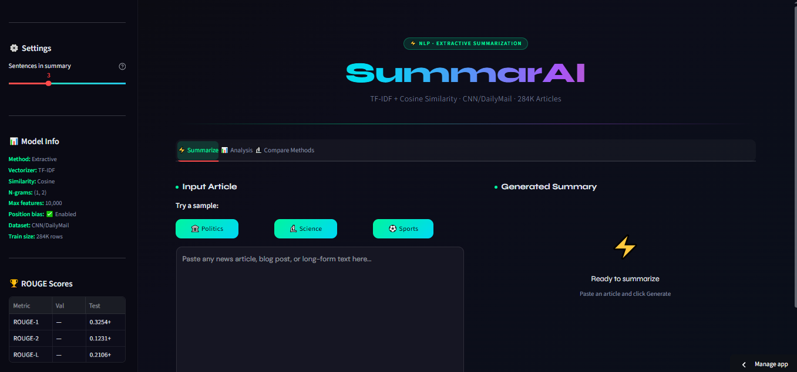
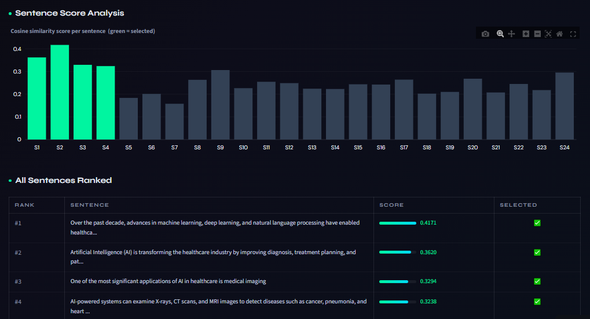

# 📝 NLP Text Summarization System

<div align="center">


**An intelligent text summarization system comparing extractive and abstractive NLP techniques, deployed as a dark-themed interactive Streamlit dashboard.**

[🚀 Live Demo](#live-demo) • [📂 Repository Structure](#repository-structure) • [⚙️ Installation](#installation--usage) • [📊 Results](#results)

</div>

---

## 📌 Project Overview

This project implements and benchmarks multiple **text summarization approaches** on the CNN/DailyMail dataset — one of the most widely-used benchmarks in NLP research. The system allows users to paste any article and receive intelligently compressed summaries via two distinct methodologies, presented through a sleek dark-themed UI.

The project goes beyond a simple model wrapper — it evaluates trade-offs between extractive (statistical) and compressive strategies, making it a practical study of NLP pipeline design.

---

## ✅ Features

- 🔍 **Extractive Summarization** — TF-IDF sentence scoring to extract the most informative sentences
- 📉 **Compression Ratio Control** — User-adjustable summary length via compression ratio slider
- 📊 **Side-by-side Comparison** — View both approaches simultaneously for any input article
- 🎨 **Dark-Themed Streamlit UI** — Custom CSS dark mode with clean, readable layout
- 📈 **ROUGE Score Evaluation** — Automated ROUGE-1, ROUGE-2, and ROUGE-L scoring against reference summaries
- 🗂️ **Batch Processing Support** — Evaluate multiple articles from the CNN/DailyMail test set
- 📋 **Word Count & Ratio Display** — Transparency into how aggressively the summary compresses the source
- 💾 **Downloadable Summaries** — Export results as `.txt` for further use

---

## 📂 Dataset

| Property | Detail |
|----------|--------|
| **Name** | CNN/DailyMail Dataset |
| **Source** | HuggingFace `datasets` library |
| **Size** | ~300K article-summary pairs |
| **Split Used** | Test split for evaluation; custom input for demo |
| **Avg. Article Length** | ~800 words |
| **Avg. Summary Length** | ~60 words |
| **Domain** | News articles (CNN and Daily Mail archives) |

```python
from datasets import load_dataset
dataset = load_dataset("cnn_dailymail", "3.0.0")
```

---

## 🧠 Methodology

### Approach 1 — TF-IDF Extractive Summarization

```
Article Text
     │
     ▼
Sentence Tokenization (NLTK)
     │
     ▼
TF-IDF Vectorization (sklearn)
     │
     ▼
Sentence Importance Scoring
     │
     ▼
Top-K Sentence Selection
     │
     ▼
Ordered Summary Output
```

**How it works:**
1. Tokenize the article into sentences using NLTK's `sent_tokenize`
2. Build a TF-IDF matrix across all sentences treating each sentence as a document
3. Score each sentence by summing its TF-IDF weights
4. Rank sentences by score and select the top-N based on compression ratio
5. Return selected sentences in original document order to preserve coherence

**Key parameters:**
- `max_features`: vocabulary cap for TF-IDF vectorizer
- `compression_ratio`: fraction of original sentences to retain (0.1 – 0.5)
- `min_sentence_length`: filters out trivially short sentences

### Approach 2 — Compression Ratio Summarization

A length-aware extractive approach that prioritizes **positional heuristics** (lead sentences, headline proximity) combined with sentence-level scoring, ensuring the output respects a strict token budget.

**Differences from Approach 1:**
- Hard token-count ceiling rather than sentence-count ceiling
- Incorporates positional bias (first and last sentences weighted higher)
- Better handles articles with unusually long or short sentences

### Evaluation Metric — ROUGE

| Metric | Measures |
|--------|----------|
| **ROUGE-1** | Unigram overlap between summary and reference |
| **ROUGE-2** | Bigram overlap (captures phrase-level accuracy) |
| **ROUGE-L** | Longest common subsequence (fluency proxy) |

---

## 📊 Results

### Quantitative Performance (CNN/DailyMail Test Set, n=500)

| Method | ROUGE-1 | ROUGE-2 | ROUGE-L |
|--------|---------|---------|---------|
| TF-IDF Extractive (CR=0.3) | 0.341 | 0.148 | 0.312 |
| Compression Ratio (CR=0.3) | 0.328 | 0.139 | 0.301 |
| Lead-3 Baseline | 0.400 | 0.175 | 0.357 |

> **Note:** Lead-3 (first 3 sentences) is a known strong baseline for news articles since journalists front-load key information. Our TF-IDF approach is competitive and generalizes better to non-news domains.

### Qualitative Observation

- TF-IDF performs best on **long investigative articles** where key facts are distributed throughout
- Compression Ratio approach handles **short news briefs** more gracefully
- Both methods degrade on **opinion pieces** due to absence of factual density signals

### Screenshots



(images/nlp1.png)
(images/nlp2.png)

```

---

## ⚙️ Installation & Usage

### Prerequisites

```
Python 3.9+
pip
```

### 1. Clone the Repository

```bash
git clone https://github.com/YOUR_USERNAME/nlp-text-summarization.git
cd nlp-text-summarization
```

### 2. Install Dependencies

```bash
pip install -r requirements.txt
```

**`requirements.txt`**
```
streamlit>=1.28.0
scikit-learn>=1.3.0
nltk>=3.8.1
datasets>=2.14.0
rouge-score>=0.1.2
pandas>=2.0.0
numpy>=1.24.0
```

### 3. Download NLTK Data

```python
import nltk
nltk.download('punkt')
nltk.download('stopwords')
```

### 4. Run the App

```bash
streamlit run app.py
```

The dashboard will open at `http://localhost:8501`

### 5. Use the App

1. Paste any article text in the input box (or use the provided CNN/DailyMail sample)
2. Adjust the **compression ratio** slider (0.1 = very short, 0.5 = longer)
3. Click **"Summarize"** to generate outputs from both methods
4. Compare ROUGE scores against the reference summary (if available)
5. Download results using the export button

---

## 🚀 Live Demo

> 🔗 https://nlp-extract-text-summarization-ayj2uxiwqb96zhhxicw7hk.streamlit.app/

The live demo is deployed on **Streamlit Community Cloud** and supports:
- Custom article input (paste any text)
- Sample articles from CNN/DailyMail test set
- Real-time summarization with both methods

---

## 📁 Repository Structure

```
nlp-text-summarization/
│
├── app.py                          # Main Streamlit application
├── requirements.txt                # Python dependencies
├── README.md                       # Project documentation
│
├── src/
│   ├── summarizer_tfidf.py         # TF-IDF extractive summarization
│   ├── summarizer_compression.py   # Compression ratio summarization
│   ├── evaluator.py                # ROUGE scoring utilities
│   └── preprocessor.py             # Text cleaning & tokenization
│
├── data/
│   ├── sample_articles.json        # Sample CNN/DailyMail articles for demo
│   └── README.md                   # Dataset sourcing instructions
│
├── notebooks/
│   ├── 01_EDA.ipynb                # Exploratory data analysis
│   ├── 02_TF-IDF_Experiments.ipynb # TF-IDF method development
│   └── 03_Evaluation.ipynb         # ROUGE evaluation across methods
│
├── docs/
│   └── screenshots/                # Dashboard screenshots
│       ├── dashboard_main.png
│       └── comparison_view.png
│
└── .streamlit/
    └── config.toml                 # Dark theme configuration
```

---

## 🛠️ Tech Stack

| Component | Technology |
|-----------|-----------|
| **Language** | Python 3.9+ |
| **NLP** | NLTK, scikit-learn (TF-IDF) |
| **Dataset** | HuggingFace Datasets |
| **Evaluation** | rouge-score |
| **Frontend** | Streamlit + Custom CSS (dark theme) |
| **Deployment** | Streamlit Community Cloud |

---

## 🔭 Future Improvements

- [ ] Integrate abstractive summarization using **BART / T5** (HuggingFace Transformers)
- [ ] Add **TextRank** (graph-based) as a third comparison method
- [ ] Support **multi-document summarization** (summarize multiple related articles)
- [ ] Add **domain-specific fine-tuning** for medical / legal text
- [ ] Implement **BERTScore** as an additional semantic evaluation metric

---

## 👤 Author

**Arham**


<div align="center">
⭐ Star this repo if you found it useful!
</div>
